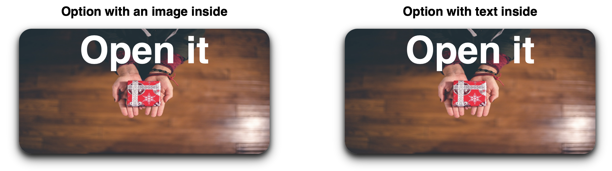

The project includes two types of boxes:

1. A box with an image inside.
2. A box with text inside.

Structure

- HTML: Creates the structure of the web page with two main boxes.
- CSS: Defines styles, animations, and transformations for the boxes.

Features

- Smooth opening animations for the boxes.
- Visual effects on hover.
- Shadows and rounded corners for enhanced appearance.

Requirements

- Support for modern browsers.
- CSS, HTML.

Usage

- Open [this link](https://syvyj.github.io/Open-Box-Hover-Animation/).
- Hover over the boxes to see the animations in action.
